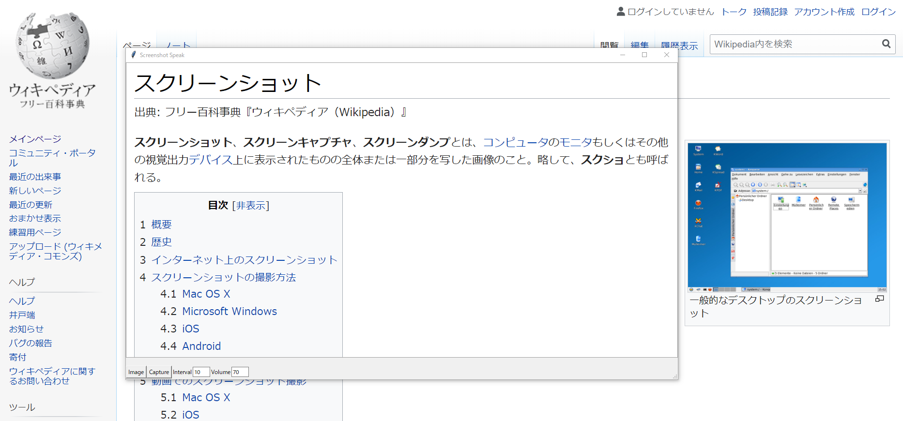

# ScreenShot Speak Window

このアプリケーションはGUIウィンドウで指定した画面の一部分のスクリーンショットからOCRでテキストを抽出し棒読みちゃん(+Voiceroid)にしゃべってもらうためのものです。

本アプリケーションはwindows10 with WSL (Ubuntu 18) で動くようになっています。
それぞれ、以下の実行環境です。

windows10
- python 3.6
  - desktopmagic
  - pygui32
  - shutil
- 棒読みちゃん
  - （あれば）Voiceroid

Ubuntu 18
- ImageMagick 6.9.7-4 Q16 x86_64
- tesseract 4.0.0-beta.1
- python 3.6

## 見た目

こんな感じ

GUIウィンドウの枠内のテキストを読みます。

まあ、精度はそんなに高くないですが...
